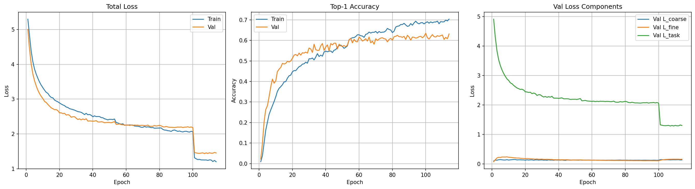
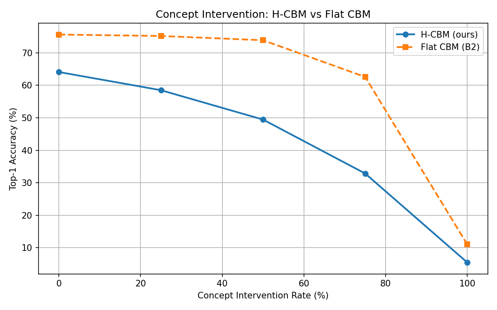
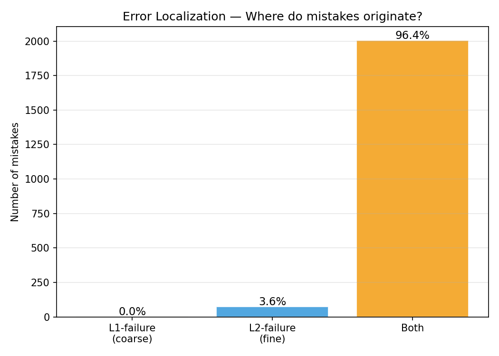
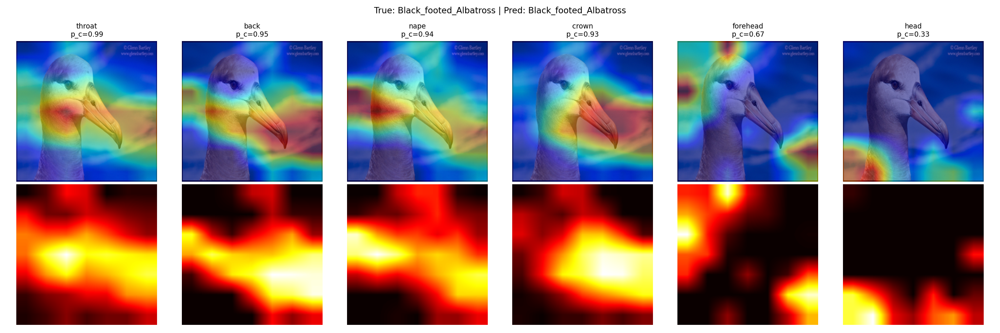

# Hierarchical Concept Bottleneck Model for Bird Classification

**Explainable and Trustworthy AI — Politecnico di Torino 2025/2026**
**Project P1 — Hierarchical Concept-Based Explainable-by-Design Models**

---

## Overview

This project implements a **Hierarchical Concept Bottleneck Model (H-CBM)** for explainable bird species classification on the [CUB-200-2011](https://data.caltech.edu/records/65de6-vp158) dataset.

Unlike standard black-box classifiers, H-CBM expresses every prediction through two levels of human-understandable concepts:

```
Image → [bill ✅  wing ✅  tail ✅]                      ← Level 1: body parts (13)
      → [bill_shape_dagger ✅  wing_color_brown ✅  ...]  ← Level 2: fine attributes (312)
      → Acadian Flycatcher 🐦
```

A key architectural constraint — the **Masked Fine Head** — ensures that if a body part is predicted absent, none of its child attributes can be active. This enforces hard hierarchical consistency at both training and inference time.

---

## Architecture

```
Input Image (3, 224, 224)
        │
        ▼
ResNet-50 (pretrained ImageNet)
        │
   Feature Map F (2048,)
        │
        ├──────────────────────────────┐
        ▼                              │ F
Coarse Head g_c(F)                    │
Linear(2048→512)→ReLU→Dropout(0.5)   │
→Linear(512→13)                       │
        │                              ▼
   p_c = σ(z_c)       Fine Head g_f(F, p_c)
   13 part probs       concat([F, p_c]) → [2061]
        │              Linear(2061→512)→ReLU→Dropout(0.5)→Linear(512→312)
        │                      │
        │              p_f[i] = σ(z_f[i]) × p_c[parent(i)]   ← Masked Fine Head
        │                      │
        └──────────────────────┘
                               │ p_f (312,)
                               ▼
                      Classifier h(p_f)
                      Linear(312→200)
                               │
                          200 species
```

### Key Design Principles

| Principle               | Description                                                           |
| ----------------------- | --------------------------------------------------------------------- |
| **Masked Fine Head**    | `p_f[i] = σ(z_f[i]) × p_c[parent(i)]` — hard architectural constraint |
| **Bottleneck Property** | Classifier reads only from `p_f`, never from raw features             |
| **L1 from parsing**     | 13 coarse concepts derived by parsing CUB attribute names             |

---

## Dataset

**CUB-200-2011** — 11,788 images of 200 North American bird species.

| Split | Size                  |
| ----- | --------------------- |
| Train | ~5,394                |
| Val   | ~600 (10% stratified) |
| Test  | 5,794                 |

- **L1 (13 parts):** `back, belly, bill, breast, crown, eye, forehead, head, leg, nape, tail, throat, wing`
- **L2 (312 attributes):** binary attributes filtered by `certainty ≥ 3`

Download:

- [CUB-200-2011 (1.2 GB)](https://data.caltech.edu/records/65de6-vp158/files/CUB_200_2011.tgz?download=1)
- [Segmentation masks (39 MB)](https://data.caltech.edu/records/w9d68-gec53/files/segmentations.tgz?download=1)

---

## Setup

```bash
git clone https://github.com/erythm/hierarchical-cbm-cub.git
cd hierarchical-cbm-cub
pip install torch torchvision pillow matplotlib numpy scikit-learn
```

This project runs on **Google Colab** (T4 GPU). Each notebook auto-downloads the dataset to local SSD on first run.

---

## Project Structure

```
hierarchical-cbm-cub/
├── src/                  ← Python modules (future)
├── plots/                ← Result visualizations
├── 01_data.ipynb         ← Data pipeline
├── 02_model.ipynb        ← Model definition
├── 03_train.ipynb        ← Training loop
├── 04_evaluate.ipynb     ← Metrics + evaluation
├── 05_xai.ipynb          ← GradCAM + faithfulness
└── README.md
```

Run notebooks in order: `01 → 02 → 03 → 04 → 05`

---

## Loss Function

```
L_total = 0.5 · L_coarse + 0.5 · L_fine + 1.0 · L_task
```

| Term       | Details                                                  |
| ---------- | -------------------------------------------------------- |
| `L_coarse` | Weighted BCE on L1 — masked by part visibility           |
| `L_fine`   | Focal Loss (α=0.25, γ=2) on L2 — masked by certainty ≥ 3 |
| `L_task`   | Cross-entropy on 200 species                             |

---

## Training

```
Optimizer:    AdamW (weight_decay=5e-4)
Backbone lr:  1e-4
Heads lr:     1e-3
Dropout:      0.5
Epochs:       107 (early stopping, patience=7)
```

---

## XAI Analysis

### GradCAM

Gradient-weighted Class Activation Maps computed on the last conv block of ResNet-50 (`layer4[-1]`). Visualizes which image regions the model focuses on when making predictions.

### Faithfulness Score

Energy-based metric — fraction of total GradCAM attention that falls inside the bird segmentation mask:

```
score = Σ(cam × mask) / Σ(cam)
```

| Metric            | Value |
| ----------------- | ----- |
| Mean Faithfulness | 26.4% |
| Min               | 3.6%  |
| Max               | 86.9% |
| Samples evaluated | 200   |

### Concept-Level GradCAM

GradCAM computed with respect to each L1 concept neuron (p_c[i]) instead of the final class output. Shows where the model looks when predicting each body part — validating that concepts are spatially grounded.

---

## Evaluation

### Standard Metrics

- Top-1 / Top-5 Accuracy (200 species)
- L1 Concept Accuracy (13 parts)
- L2 Concept macro-F1 (312 attributes)
- AUROC per concept → macro-average

### Hierarchy-Aware Metrics

- **Concept Intervention** — inject ground-truth concepts at [0%, 25%, 50%, 75%, 100%]
- **Semantic Mistake Severity** — mild vs severe based on bird family
- **Error Localization** — classify each mistake as L1-failure, L2-failure, or Both
- **Hierarchy Consistency Rate** — fraction of predictions where `p_f[child] ≤ p_c[parent]`

### Baselines

| Model            | Description                             |
| ---------------- | --------------------------------------- |
| ResNet-50 (B1)   | No CBM — accuracy upper bound           |
| Flat CBM (B2)    | Only L2, no hierarchy (Koh et al. 2020) |
| **H-CBM (ours)** | Masked Hierarchical CBM                 |

---

## Results

### Final Comparison Table

| Model            | Top-1     | Top-5     | L1 Acc    | L2 F1     | L2 AUROC  | Mild%     | Consistency |
| ---------------- | --------- | --------- | --------- | --------- | --------- | --------- | ----------- |
| ResNet-50 (B1)   | 79.5%     | 94.1%     | —         | —         | —         | 48.4%     | —           |
| Flat CBM (B2)    | 75.7%     | 92.4%     | —         | 0.173     | 0.589     | 46.2%     | —           |
| **H-CBM (ours)** | **64.1%** | **89.8%** | **75.7%** | **0.153** | **0.558** | **45.8%** | **100%**    |

### Key Findings

- **Hierarchy Consistency: 100%** — Masked Fine Head perfectly enforces `p_f[child] ≤ p_c[parent]` across all 1,610,732 pairs at inference time
- **Error Localization:** 96.4% of mistakes involve both L1 and L2 — cascade effect of Masked Fine Head
- **GradCAM Faithfulness:** 26.4% of attention energy falls inside the bird mask
- **Concept-Level GradCAM:** each L1 concept attends to its semantically correct spatial region

### Training Curves



### Concept Intervention



### Error Localization



### GradCAM Visualizations


### Concept-Level GradCAM



---

## References

|     | Paper                                                                                    |
| --- | ---------------------------------------------------------------------------------------- |
| [1] | Koh et al. — _Concept Bottleneck Models_ — ICML 2020                                     |
| [2] | Pittino et al. — _Hierarchical CBM for Vision_ — EAAI 2023                               |
| [3] | Sun et al. — _Supervised Hierarchical CBM_ — Under review                                |
| [4] | Poeta et al. — _Concept-based XAI: A Survey_ — ACM 2025                                  |
| [5] | Bertinetto et al. — _Making Better Mistakes_ — CVPR 2020                                 |
| [6] | Hase et al. — _Interpretable Image Recognition with Hierarchical Prototypes_ — AAAI 2019 |
| [7] | Lin et al. — _Focal Loss_ — ICCV 2017                                                    |
