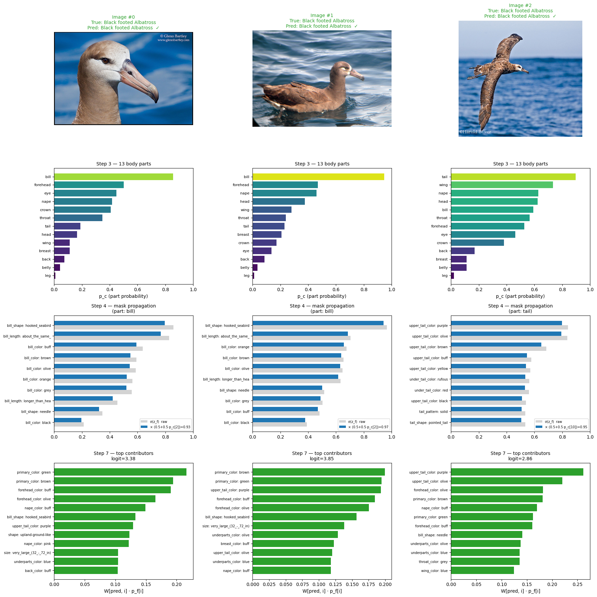
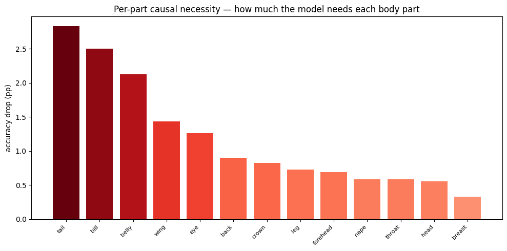

# Hierarchical Concept Bottleneck Models for Explainable Bird Classification

**Explainable and Trustworthy AI — Politecnico di Torino 2025/2026**  
Paniz Falahatinezhad · Erfan Moghadasian · Sina Ghiabi  
Reference teachers: Eliana Pastor, Eleonora Poeta

---

## Overview

We classify 200 bird species from [CUB-200-2011](https://data.caltech.edu/records/65de6-vp158) (~12k images) using a model that explains every prediction in human-readable terms. Instead of going straight from pixels to a species name, the model first answers two questions:

1. **Which body parts are visible?** — 13 parts (`bill`, `wing`, `tail`, `belly`, …)
2. **What does each part look like?** — 312 fine attributes (e.g. `bill_shape::dagger`, `wing_color::brown`)

Only then does it predict the species via a single `Linear(312 → 200)` layer. Every prediction is fully explained by a named concept vector — no post-hoc attribution needed.

```
Image → 13 body parts → 312 fine attributes → species (1 of 200)
```

### Masked Fine Head

The core architectural contribution ties every fine attribute to its parent body part through a multiplicative gate applied identically at training and inference:

$$p_f[i] = \sigma(z_f[i]) \times (0.5 + 0.5 \cdot p_c[\text{parent}(i)])$$

The gate is in `[0.5, 1]` (not `[0, 1]`) to keep gradients alive early in training while still enforcing a parent-conditioned ceiling. Hierarchy violations are **mathematically impossible** — unlike prior work (Pittino et al. 2023) where the constraint is only a soft loss penalty.

### Two Backbones Compared

We train two independent H-CBMs with the **same design** but different backbones and compare them head-to-head on interpretability metrics — not just accuracy:

|                     | ResNet-50           | ViT-B/16                   |
| ------------------- | ------------------- | -------------------------- |
| Feature dim         | 2048                | 768                        |
| Input size          | 336 × 336           | 384 × 384                  |
| Pretrain            | ImageNet-V2         | SWAG E2E (3.6B images)     |
| Spatial attribution | Grad-CAM (post-hoc) | Native CLS-token attention |

---

## Decision Walkthrough



_Step-by-step: image → 13 part probabilities → masked fine attributes → top contributors → predicted species._

---

## Results

### Per-Attribute Concept Quality (AUC)

| ResNet-50                                       | ViT-B/16                                  |
| ----------------------------------------------- | ----------------------------------------- |
|  |  |

_Top-10 best and worst detected attributes per backbone. Yellow body-part colours are easiest; rare colours (pink, purple) and unusual shapes are hardest — on both backbones._

### Test-Time Intervention (TTI) Curve


_Replacing predicted concepts with class-prototype values at increasing fractions `r`. The monotonically rising curve confirms the bottleneck is genuine — there is no hidden shortcut._

### Per-Part Causal Necessity

| ResNet-50                                       | ViT-B/16                                  |
| ----------------------------------------------- | ----------------------------------------- |
|  |  |

_Accuracy drop when each body part's concept columns are zeroed. `bill`, `tail`, and `belly` are the most causally necessary parts on both backbones._

---

## Notebooks

| Notebook                                         | What it does                                                           |
| ------------------------------------------------ | ---------------------------------------------------------------------- |
| `01_data.ipynb`                                  | Data pipeline: CUB-200-2011 → 13/312 hierarchy → train/val/test splits |
| `02_H-CBM ResNet-50_train.ipynb`                 | Train H-CBM with ResNet-50 backbone (3-phase schedule)                 |
| `02_H-CBM ResNet-50_explainability.ipynb`        | 9-section explainability analysis for ResNet-50                        |
| `03_H-CBM ViT-B16_train.ipynb`                   | Train H-CBM with ViT-B/16 backbone (3-phase schedule)                  |
| `03_H-CBM ViT-B16_explainability.ipynb`          | 9-section explainability analysis for ViT-B/16                         |
| `04_H-CBM Comparison ResNet-50 vs ViT-B16.ipynb` | Head-to-head comparison across 10 interpretability axes                |

The two branches (02 and 03) are **independent** — you can run either one without the other. Notebook 04 requires both checkpoints.

---

## Setup

```bash
git clone https://github.com/erythm/hierarchical-cbm-cub.git
cd hierarchical-cbm-cub
pip install torch torchvision pillow matplotlib numpy scikit-learn pandas
```

Training notebooks are designed for **Google Colab (A100/H100)** with BF16 AMP and `torch.compile`. Explainability and comparison notebooks run on any GPU or CPU.

### Dataset

Download [CUB-200-2011](https://data.caltech.edu/records/65de6-vp158) and place it under:

```
MyDrive/XAI-Project/DB/DB1/CUB_200_2011/
```

---

## References

1. Koh et al. — _Concept Bottleneck Models_ (ICML 2020)
2. Pittino et al. — _Hierarchical CBM for Vision_ (EAAI 2023)
3. Sun et al. — _Supervised Hierarchical CBM_ (under review)
4. Poeta et al. — _Concept-based XAI: A Survey_ (ACM CSUR 2025)
5. Lin et al. — _Focal Loss for Dense Object Detection_ (ICCV 2017)
6. Kendall et al. — _Multi-Task Learning Using Uncertainty_ (CVPR 2018)
